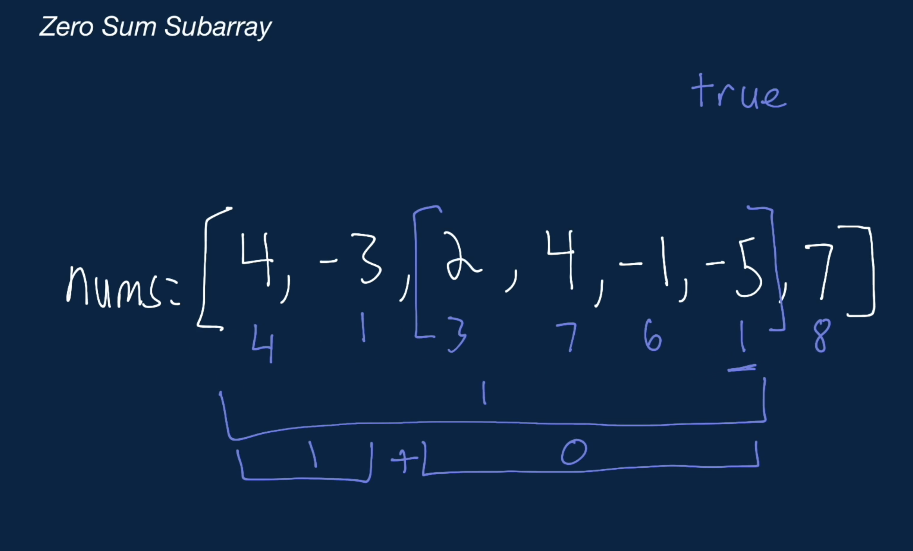

# Zero Sum Subarray

<div class="html">
  <p>
    You're given a list of integers <span>nums</span>. Write a function that
    returns a boolean representing whether there exists a zero-sum subarray of
    <span>nums</span>.
  </p>

  <p>
    A zero-sum subarray is any subarray where all of the values add up to zero.
    A subarray is any contiguous section of the array. For the purposes of this
    problem, a subarray can be as small as one element and as long as the
    original array.
  </p>
<h3>Sample Input</h3>
<pre><span class="CodeEditor-promptParameter">nums</span> = [-5, -5, 2, 3, -2]</pre>
<h3>Sample Output</h3>
<pre>True <span class="CodeEditor-promptComment">// The subarray [-5, 2, 3] has a sum of 0
</span>
</pre></div>

<h2>Hints</h2>

<p>
  A good way to approach this problem is to first think of a simpler version.
  How would you check if the entire array sum is zero?
</p>
<p>
  If the entire array does not sum to zero, then you need to check if there are
  any smaller subarrays that sum to zero. For this, it can be helpful to keep
  track of all of the sums from [0, i], where i is every index in the array.
</p>
<p>
  After recording all sums from [0, i], what would it mean if a sum is repeated?
</p>
<h2>Optimal Space & Time Complexity</h2>

<div class="U1quNvMraAr3Hbq2JfVQ">O(n) time | O(n) space - where n is the length of nums</div>

```javascript
function hasZeroSumSubarray(nums) {
  const sumMap = new Map();
  let sum = 0;

  for (let i = 0; i < nums.length; i++) {
    sum += nums[i];
    if (sum === 0 || sumMap.has(sum)) {
      return true;
    }
    sumMap.set(sum, i);
  }

  return false;
}

```
